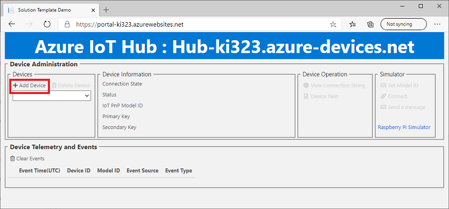
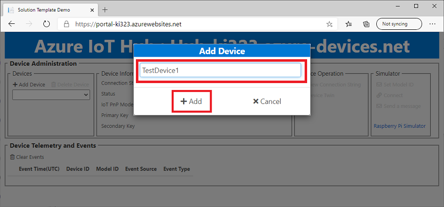
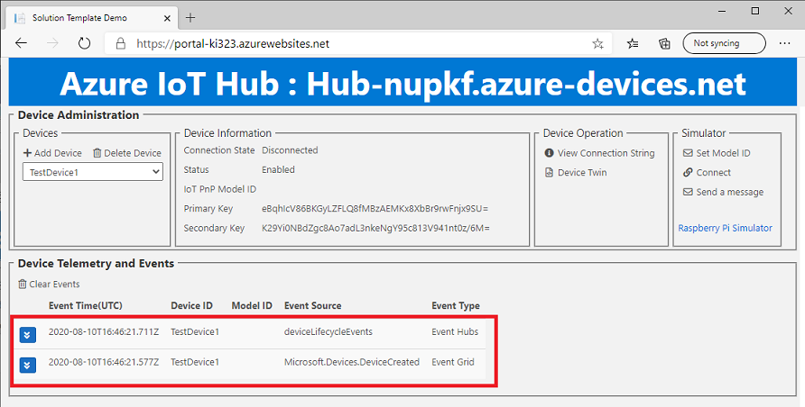

# Adding a new IoT Device to IoT Hub

The sample portal site is ready to accept data.  In order to send data to the sample portal through IoT Hub, we need to create a new device.

## Adding a new IoT device

1. Click `+ Add Device`

    

1. Type a new device ID, then click `+ Add Device` to create a new IoT Device in your IoT Hub

    E.g. Adding `TestDevice1`

    

1. Verify the Web App receives 2 messages

    - 1 x `Microsoft.Devices.DeviceCreated` event from Event Grid
    - 1 x `deviceLifecycleEvents` from Event Hubs 

    

1. The web app should receive Telemetry Events

## Adding a new IoT device in Azure Portal

1. Go back to `Overview` then click `Go to resource group`

    

1. The resource group should contain 7 resources.  Click on IoT Hub resource.  (e.g. Hub-ki323)

    > [!NOTE]  
    > Last 5 letters of resource names are unique for each deployment.  Your IoT Hub name should be `Hub-[Unique 5 letters]`

    

1. Select `IoT Device` from menu, then click `+ New`

   

1. Name a new device then click `Save` to create a new IoT device.

   
 
## Receiving device events

When a new IoT device is created in the IoT Hub, IoT Hub publishes a new event.  Confirm you receive the event in The sample portal site.

> [!TIP]  
> You can click on the event to expand to show details

## Next Step

The new IoT device is ready to connect and send data.  Let's send data to IoT Hub.

- [Sending Telemetry](Telemetry.md)

- [Deploy Solution Accelerator for Conservation & Sustainability](README.md)
- [Project 15 from Microsoft](../README.md)