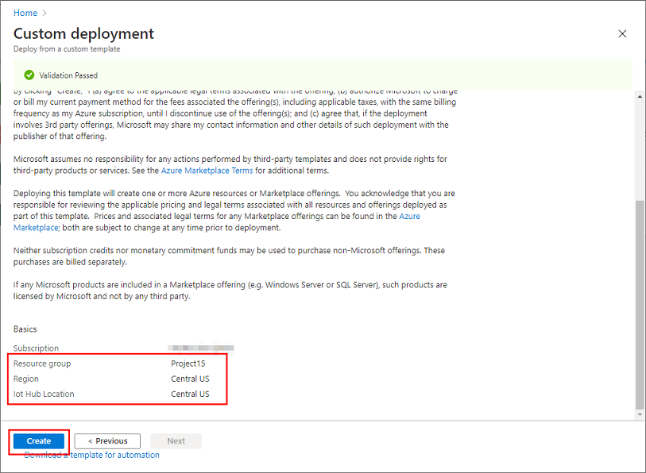
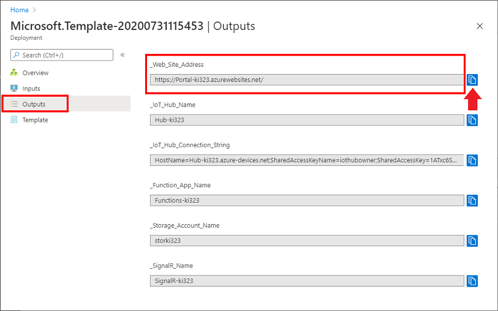

# Deploy Solution Accelerator for Conservation & Sustainability

## Sign in to Azure

If you do not have Azure Account, please obtain one for free at <https://azure.microsoft.com/en-us/free/>

## Deploy in Advanced Template

Azure Resource Manager (ARM) template with more user input options.

- During the deployment, user may choose resource names of their choice.
- Specify Github repositories and branches for Web App and Functions App
- Specify IoT Hub SKU

If you prefer more control, please refer to [Simple Deployment Template](README.md)

1. Click `Deploy to Azure` button below  

    > [!TIP]  
    > Right click the button below and select `Open link in new tab` or `Open lin in new window`

    

1. Select or create Resource Group, and provide resource names

    

1. Select `Region` and `IoT Hub Location`  

    > [!IMPORTANT]  
    > As of 7/31/2020, the solution accelerator uses new IoT Plug and Play features.  
    > IoT Plug and Play is enabled in these regions.  
    > Please select **Central US**, **Japan East**, or **North Europe**

    

1. Click `Review + create`

1. Review Resource Group Name, Region, and IoT Hub Location, then click `Create`

    

1. Wait for ~ 7 minutes for the deployment to complete

    

1. Select `Output` from left menu, then copy `IoT Hub Connection String` and `Web Site Address`

    > [!TIP]  
    > Copy Connection String and Web Site Address by pressing .  
    > Paste them to a text file for later use.

    

## Access to the solution acceleration web site

The web site is very generic web application.  The web site will receive device telemetry and events.

1. Open`Web Site Address` with a browser  

    

## Next Step

The sample portal site is ready to accept connection.  Let's add a new IoT device to IoT Hub.

- [Adding a new IoT Device to IoT Hub](IoTDevice.md)