# Sending Telemetry

The sample portal site is ready to accept data.  Send telemetry data to the sample portal site through IoT Hub.

If you do not have a real/physical device, you can still send telemetry using a simulator.

## Sending messages from Web Client

For the verification purpose, the web portal app contains device application simulator code to :

- Connect and Disconnect
- Send a telemetry message

1. Select a device from the list  

    If you do not see any devices in the list, please add one.  ([Instruction](IoTDevice.md))

    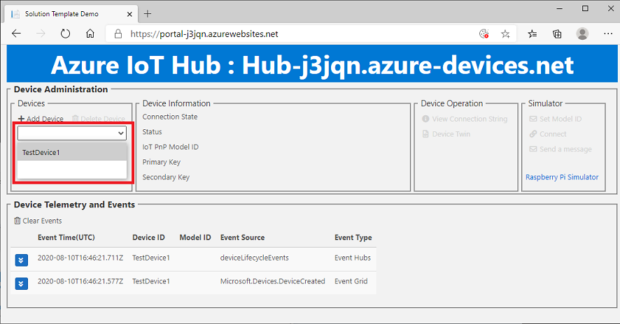

1. Once a device is selected, the web app should populate data under `Device Information`

    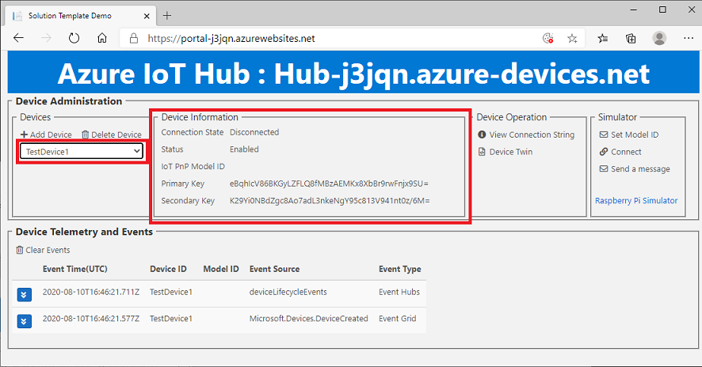

1. Click on `Connect` and `Send a message` to send a message  

    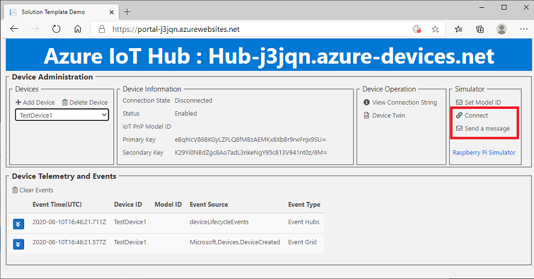

1. The web app should receive `Connect` and `Disconnect` events, and `Telemetry` messages.

    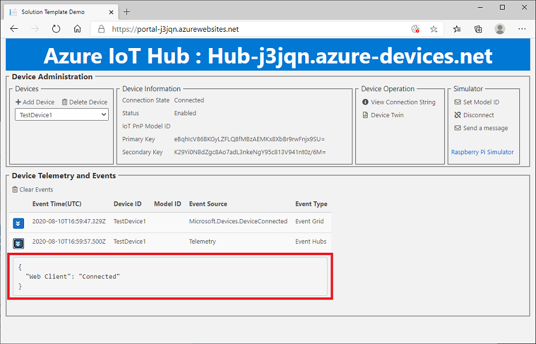

    > [!NOTE]  
    > Telemetry messages should be delivered to the web app with very small latency (up to a few seconds), but events may experience up to 1 min delay.  
    > These are expected.

## Raspberry Pi Online Simulator

Raspberry Pi Online Simulator is an online tool you can send simulated temperature and humidity telemetry to IoT Hub.

1. Open a new browser window then navigate to <https://azure-samples.github.io/raspberry-pi-web-simulator/>

    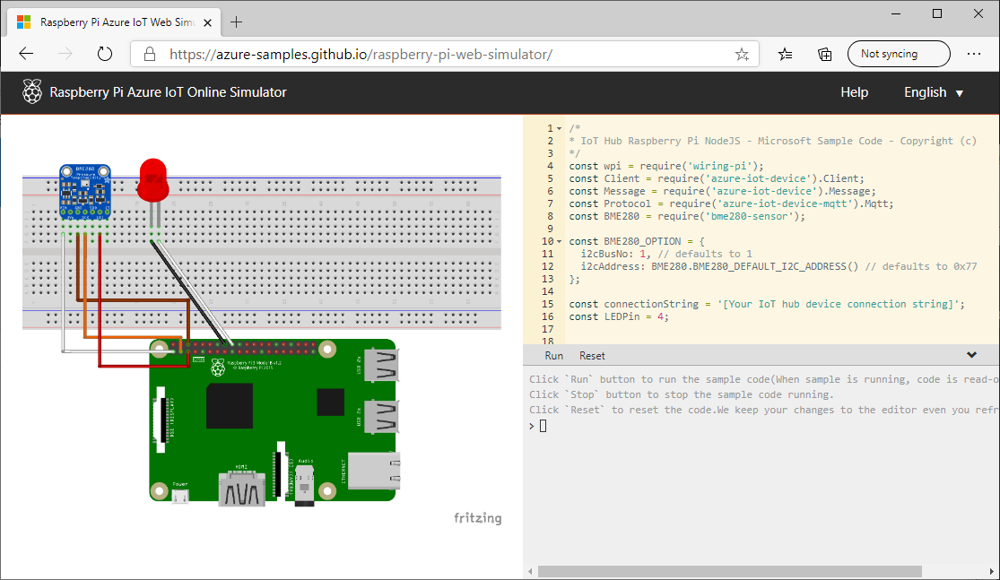

1. Go back to the web app, then click on `View Connction String`

    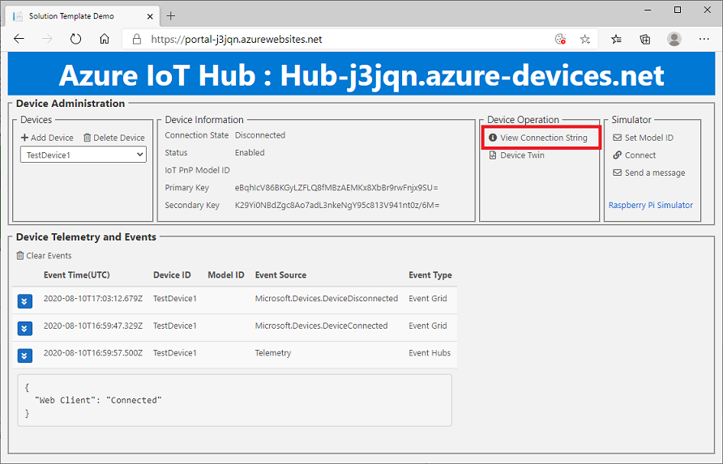

1. Copy the connection string

    > [!TIP]  
    > To copy the connection string, select the connection string (From `HostName` ~ ) with mouse, then `CTRL + C` or right click to display the context menu

    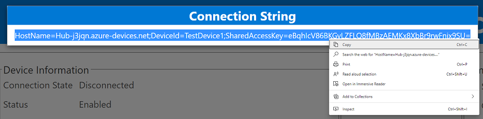

1. Replace line #15 with the connection string

    Example : 

    ```shell
        :
    const connectionString = '[Your IoT hub device connection string]';
        :
    ```

    to

    ```shell
        :
    const connectionString = 'HostName=Hub-ki323.azure-devices.net;DeviceId=MyFirstDevice;SharedAccessKey=testtesttestetest=';
        :
    ```

    

## Sending Telemetry to IoT Hub

1. Click `Run` to start sending messages

    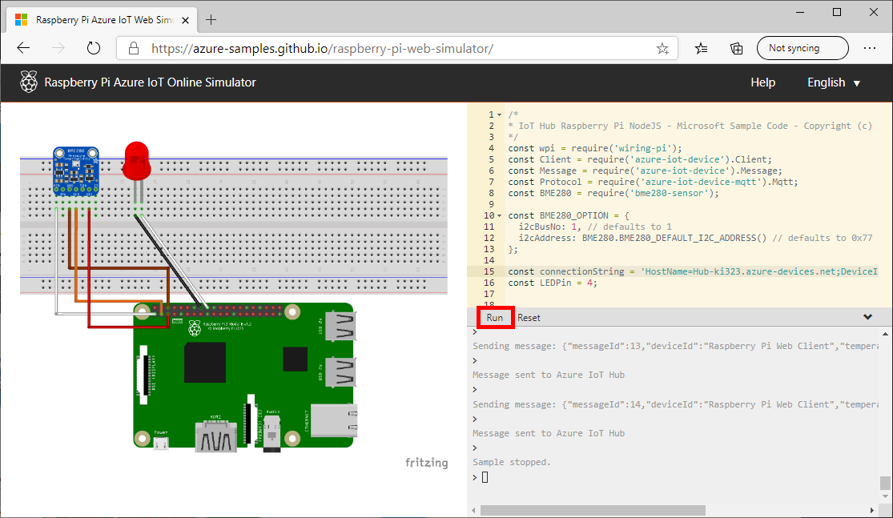

1. Telemetry data should be sent to the Portal Web site in real time

    > [!TIP]  
    > The initial connection may take time to initialize Azure Functions

    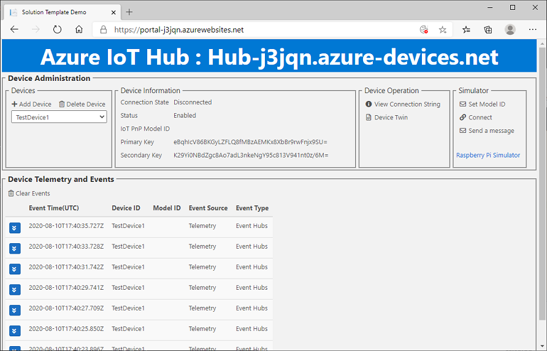

## Next Step

Completed!

If you would like to delete all Azure resources, delete the resource group in Azure Portal.

1. Access to [Azure Portal](http://portal.azure.com)
1. Select `Resource Groups` from the menu

    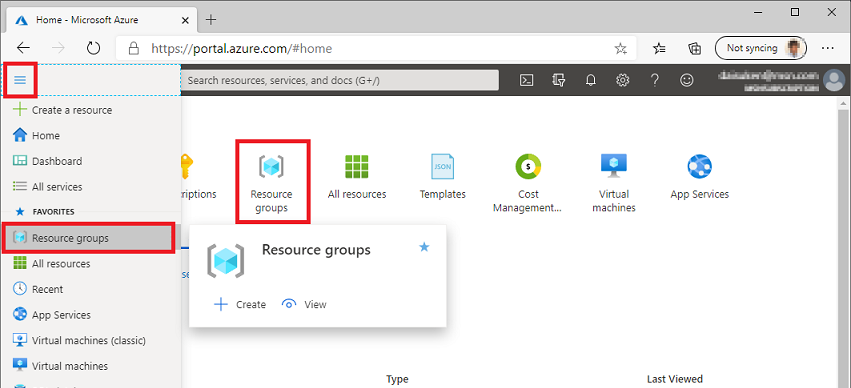

1. Select the resource group you created [earlier](README.md#deploy-with-arm-template)

    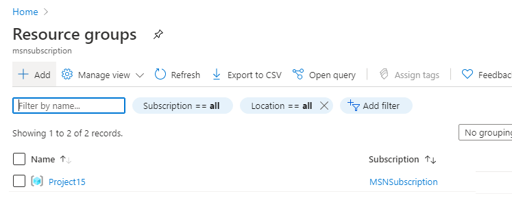

1. Click `Delete resource group` to delete all resources

    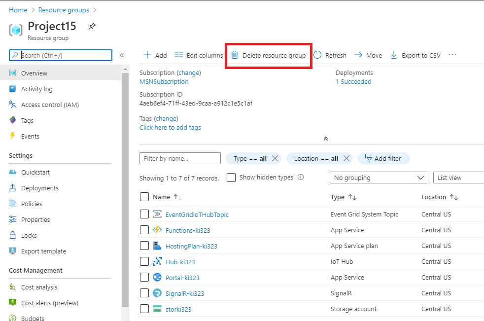

- [Project 15 from Microsoft](../README.md)