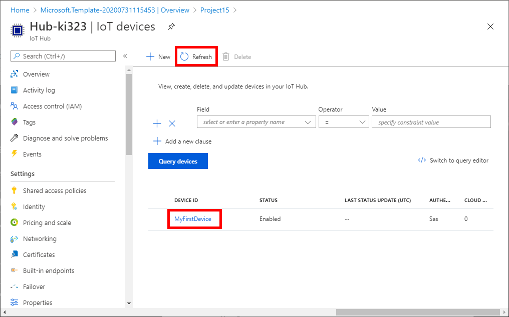

# Sending Telemetry

The sample portal site is ready to accept data.  Send telemetry data to the sample portal site through IoT Hub.

If you do not have a real/physical device, you can still send telemetry using a simulator.

## Raspberry Pi Online Simulator

Raspberry Pi Online Simulator is an online tool you can send simulated temperature and humidity telemetry to IoT Hub.

1. Open a new browser window then navigate to <https://azure-samples.github.io/raspberry-pi-web-simulator/>

    

1. Go back to Azure Portal browser window, then click the new IoT device just created

    > [!TIP]  
    > If you do not see the device, click `Refresh` button

    

1. Copy `Primary Connection String` in Azure Portal window

    

1. Replace line #15 with the connection string

    Example : 

    ```shell
        :
    const connectionString = '[Your IoT hub device connection string]';
        :
    ```

    to

    ```shell
        :
    const connectionString = 'HostName=Hub-ki323.azure-devices.net;DeviceId=MyFirstDevice;SharedAccessKey=testtesttestetest=';
        :
    ```

    

## Sending Telemetry to IoT Hub

1. Click `Run` to start sending messages

    

1. Telemetry data should be sent to the Portal Web site in real time

    > [!TIP]  
    > The initial connection may take time to initialize Azure Functions

    

## Next Step

Completed!

- [Project 15 from Microsoft](../README.md)